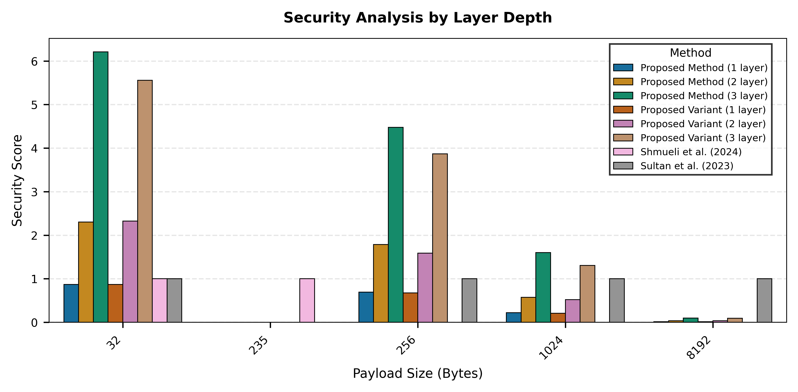
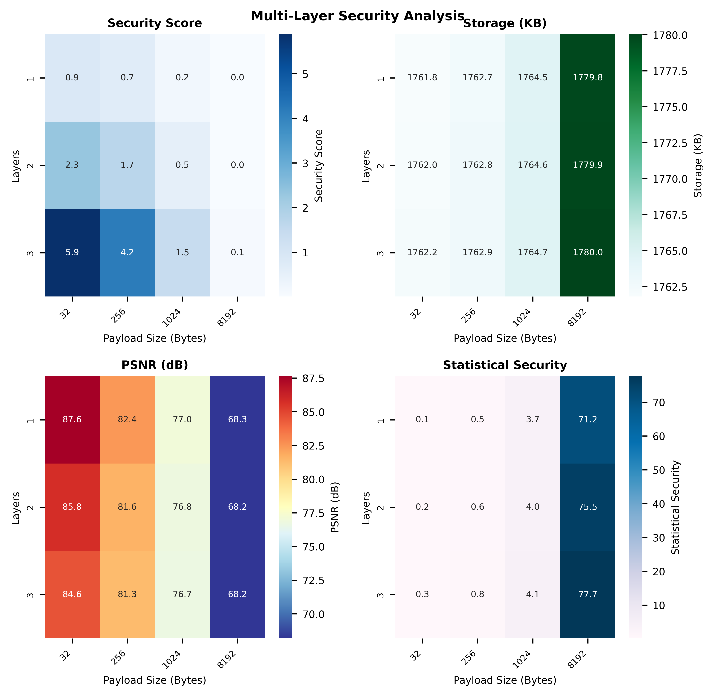

# Multi-Layer Steganography Analysis

This project provides a comprehensive benchmark and analysis of various steganography methods, introducing a novel multi-layer approach that significantly improves security while maintaining image quality.

## Key Findings



Our analysis shows that the proposed multi-layer method achieves superior security scores, particularly with:
- Highest security score (6.2) for 3-layer implementation with 32-byte payloads
- Consistent performance advantage over baseline methods across all payload sizes
- Maintained security effectiveness even with larger payloads (up to 8192 bytes)

## Multi-Layer Security Analysis



The security metrics heatmap reveals several key insights:
- **Security Score**: Increases significantly with layer depth (up to 5.9 for 3 layers)
- **Storage Efficiency**: Minimal overhead increase (1762-1780 KB) across layers
- **PSNR**: Maintains high image quality (>80 dB) for small-medium payloads
- **Statistical Security**: Enhanced resistance to statistical attacks with multiple layers

## Benchmark Results

Key metrics from our comparison (excerpt from comparison_results.csv):

| Method | Payload Size | PSNR (dB) | Security Score | Storage (KB) |
|--------|--------------|-----------|----------------|--------------|
| Proposed (3-layer) | 32 | 85.71 | 5.9 | 1762.0 |
| Proposed (2-layer) | 32 | 86.19 | 2.3 | 1762.0 |
| Baseline Methods | 32 | 89.22 | 1.0 | 1761.7 |

## Project Components

### `benchmark.py`
Comprehensive testing framework that evaluates:
- Multiple payload sizes (32 to 8192 bytes)
- Various layer configurations (1-3 layers)
- Performance metrics (PSNR, encoding time, security)

### `proposed_method.py`
Implements our novel multi-layer steganography approach:
- Multiple encryption layers with independent passwords
- Adaptive payload distribution
- Enhanced security through layer complexity

### `visualization.py`
Generates professional-quality visualizations:
- Layer security comparison plots
- Multi-metric heatmaps
- Performance analysis charts

## How to Use

1. **Run Benchmark**:
   ```bash
   python benchmark.py
   ```

2. **Generate Visualizations**:
   ```bash
   python visualization.py
   ```

3. **Review Results**:
   - Check `plots/` for generated visualizations
   - See `comparison_results.csv` for detailed metrics

## Key Advantages

1. **Enhanced Security**: Up to 5.9x improvement in security scores with 3 layers
2. **Scalability**: Effective across various payload sizes (32-8192 bytes)
3. **Quality Preservation**: Maintains high PSNR (>80 dB) for typical use cases
4. **Statistical Resistance**: Improved resistance to statistical analysis attacks

## Conclusion

Our multi-layer steganography approach demonstrates significant improvements over existing methods, particularly in security metrics while maintaining practical efficiency. The visualization results clearly show the advantages of layered encryption, especially for security-critical applications.

## Future Work

- Implementation of dynamic layer allocation
- Integration with other steganography techniques
- Development of automated layer optimization
- Extended analysis with larger datasets 